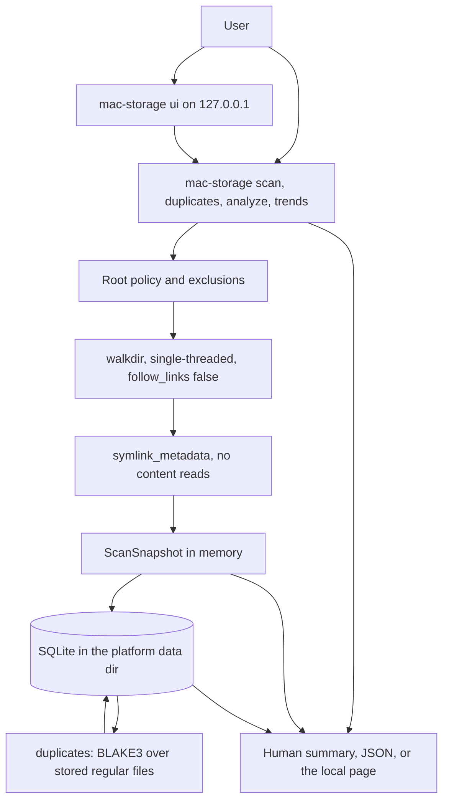

# Architecture

Mac Storage Advisor is a local Rust workspace. `scan` records metadata. `duplicates` hashes regular files from a stored scan. Nothing is uploaded or deleted.

## System context

Logs go to stderr. They include scan start and finish with directory, file, byte, skip, error, and duration fields. Verbose mode can log each path and size. File contents are never logged. `--redact-paths` redacts paths in those logs only. The JSON report and the database still store paths, because the operator asked for a local inventory.

## Crates

| Crate | Role | May depend on |
| --- | --- | --- |
| `mac-storage-common` | Display name, domain types, CLI-facing error | `serde`, `thiserror` |
| `mac-storage-scanner` | Walk, exclusions, metadata | `common`, `walkdir`, `tracing` |
| `mac-storage-duplicates` | Size, inode, and BLAKE3 grouping | `common`, `blake3` |
| `mac-storage-analyze` | Stale files, Downloads, artifact trees, suggestions, trends, placeholder and extent notes | `common` |
| `mac-storage-remediate` | Confirmed move of inventoried paths to the OS Trash | `scanner`, `trash` |
| `mac-storage-storage` | SQLite open, migrations, save/load | `common`, `rusqlite`, `directories` |
| `mac-storage` (`apps/cli`) | Command line and `ui` on `127.0.0.1` | all of the above, `clap`, `tiny_http`, `tracing-subscriber` |

`common` does not depend on the scanner, duplicates, analyze, or storage. The scanner does not depend on storage and does not read file contents. The duplicates and analyze crates do not depend on storage. The CLI loads rows, runs the pass, and writes hashes back. Suggestions are computed when requested and are not stored.

The display name is `PRODUCT_NAME` in `crates/common`. Binary and package names stay `mac-storage` / `mac-storage-*`.

## Data flow

1. The CLI parses `scan <PATH>` and builds a `ScanTarget`.
2. `scan_path` resolves the root lexically (`std::path::absolute` plus `.` / `..` cleanup). It does not canonicalize, so symlinks are not resolved.
3. The root must exist, must not itself be a symlink, and must be a directory. An exact protected macOS prefix is refused unless `--allow-protected-roots` is set.
4. `walkdir` walks descendants with `follow_links(false)` and sorts names in each directory. Excluded entries are not descended into.
5. Each entry is `lstat`ed. Failures become `ScanErrorRecord` values and the walk continues.
6. The snapshot is inserted in one SQLite transaction.
7. The CLI prints the human summary or the `ScanReport` JSON.

`--threads` is stored on the scan row. `SCAN_CONCURRENCY` is 1. The flag does not start a thread pool. Hashing uses that same single thread. That decision is deferred rather than a pool in v0.2.

## Exclusion rules

Patterns are trimmed. A trailing `/` is ignored. Empty patterns are ignored. `.` and `..` are rejected. A pattern that normalizes to the scan root is a fatal error.

| Form | Meaning |
| --- | --- |
| No `/` and no `*` or `?` | The entry's own file name. A matching directory is not descended into. `bin` skips a directory named `bin`. It does not mean the prefix `/bin`. |
| Contains `/`, no glob | Path prefix, component-wise, after joining a relative pattern to the scan root. `/usr` matches `/usr` and `/usr/bin`, not `/usr2`. Symlinks are not resolved. |
| Contains `*` or `?` and no `/` | Glob against the entry's file name. `*` stays inside that name. `*.dmg` matches `a.dmg` anywhere. |
| Contains `*` or `?` and `/` | Component glob. A segment that is exactly `**` spans directories. An absolute pattern matches from the root. A relative pattern matches a suffix, so `Downloads/*.dmg` matches `…/Downloads/a.dmg` and not `…/Downloads/sub/a.dmg`. |

The scan root itself is never dropped by the walk filter.

### Protected macOS prefixes

`/System`, `/private`, `/bin`, `/sbin`, `/usr`, and `/Library` are prefix exclusions only when they are proper descendants of the scan root. Scanning `/` skips them. Scanning `~/Downloads` does not. Scanning `/usr/local/myproject` is allowed because the root is not exactly `/usr`. Passing exactly `/usr` (or another prefix) as the root is refused unless `--allow-protected-roots` is set. Comparison is case-sensitive.

## Why `walkdir`

`ignore` implements gitignore semantics this scanner does not want. `walkdir` is the smaller crate and exposes `follow_links(false)`, per-entry errors, and a directory filter. Exclusion syntax lives in this repo so the rules above stay explicit.

## Dependency rules

- No outbound network client. Paths, names, hashes, and contents are not uploaded. Hashes are computed only by `duplicates`. `mac-storage ui` listens on `127.0.0.1` and refuses a different Host header.
- No `unsafe` in workspace crates (`forbid(unsafe_code)`).
- `rusqlite` is built with the `bundled` feature so CI does not need a system SQLite.
- `blake3` is used by the duplicates crate. `tiny_http` serves the local page. `tauri` opens that page in a native window and, on macOS, packages the same binary as `Mac Storage Advisor.app`. The `trash` crate moves a confirmed path to the OS Trash. `rayon` and `notify` are still absent.

## Decisions

See [docs/adr](adr/).
